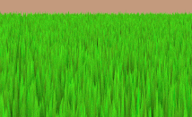

# DX12 Renderer

## Demos

### Deferred

- [DeferredLightingDemo](./Demos/DeferredLightingDemo)
  - Deferred rendering pipeline:
    - Directional, Point, Spot, and Capsule lights;
    - Light passes are implemented using the stencil buffer;
  - PBR:
    - Cook-Torrance BRDF model;
    - Image-Based Lighting:
      - Diffuse (Irradiance Map) and Specular (Pre-Filtered Environment Map);
      - Both maps are computed on application start based on an HDR skybox cubemap;
  - HDR pipeline:
    - Render targets supporting HDR (`R16G16B16A16_FLOAT`);
    - Auto exposure via a Luminance Histogram implemented in Compute shaders;
    - Tone mapping;
  - TAA;
  - SSAO;
  - SSLR.

| SSAO Off                                                     | SSAO On                                                    |
| ------------------------------------------------------------ | ---------------------------------------------------------- |
|  |  |

| SSLR Off                                                     | SSLR On                                                    |
| ------------------------------------------------------------ | ---------------------------------------------------------- |
|  |  |

#### Controls

- Use <kbd>WASD</kbd>/Arrow Keys to move the camera;
- Hold <kbd>LMB</kbd> and move the mouse to orient the camera;
- Press <kbd>L</kbd> to toggle light animation;
- Press <kbd>T</kbd> to toggle TAA;
- Press <kbd>O</kbd> to toggle SSAO;
- Press <kbd>P</kbd> to toggle SSLR.
- Press <kbd>B</kbd> to toggle Bloom.

### Forward

- [LightingDemo](./Demos/LightingDemo)
  - Models loaded from OBJ files;
  - .DDS textures loading:
    - Textures for this demo are stored in `BC7_UNORM`.
  - Mipmapping;
  - Phong lighting with a directional light and several point and spot lights;
    - Using diffuse, normal, gloss, and specular maps;
  - Particle system with CPU simulation (10000+ particles on screen) and instanced rendering;
  - Shadow mapping for the directional, point, and spot lights;
  - MSAA:
    - Built-in resolve for color;
    - Custom compute pass for the depth attachment (`min` among all samples);
  - Soft shadows using 16x Poisson Sampling and Early Bail;
  - Dynamic environment reflections - see the sphere;
  - Post-processing:
    - Screen-space fog;
    - Bloom.

#### Controls

- Use <kbd>WASD</kbd>/Arrow Keys to move the camera;
- Hold <kbd>LMB</kbd> and move the mouse to orient the camera;
- Press <kbd>L</kbd> to toggle light animation.

### ToonDemo

- [ToonDemo](./Demos/ToonDemo)
  - Toon/Cel-Shading:
    - Diffuse ramp texture;
    - Configurable specular;
    - Cross-hatching pattern;
  - Variance Shadow Mapping (Directional Light);
  - Post-processing:
    - Outline (Sobel-filter);
    - FXAA;
    - Bloom.

#### Controls

- Use <kbd>WASD</kbd>/Arrow Keys to move the camera;
- Hold <kbd>LMB</kbd> and move the mouse to orient the camera;
- Press <kbd>L</kbd> to toggle light animation.

### MeshletsDemo

- [MeshletsDemo](./Demos/MeshletsDemo)
  - Meshlets are built via [meshoptimizer](https://github.com/zeux/meshoptimizer).
  - GPU Meshlet Culling:
    - Cone backface culling;
    - Frustum culling (bounding spheres);
    - HDB (Hi-Z) occlusion culling (bounding spheres or AABBs):
      - Additional low poly geometry is treated as occluders (red transparent in the screenshot); 
  - Culled meshlets are rendered via `ExecuteIndirect`;
  - Uses Render Graph.

#### Controls

- Use <kbd>WASD</kbd>/Arrow Keys to move the camera;
- Hold <kbd>LMB</kbd> and move the mouse to orient the camera;
- Press <kbd>C</kbd> to "freeze" the camera for cone and frustum culling;
- Press <kbd>M</kbd> and <kbd>N</kbd> to scroll the debugged meshlets forwards and backwards respectively.

### RenderGraph

- [RenderGraph](./Demos/RenderGraph)
  - A simple implementation of a render graph:
    - Passes are defined via lambdas;
    - Resources are marked as either inputs or outputs;
    - GPU memory is aliased between different buffers and render targets when their lifetimes do not overlap; 
    - Special "Token" resources are used for more controlled render pass ordering.

### GrassDemo

- [GrassDemo](./Demos/GrassDemo)
  - ~45k individual grass blades sent to rendering after culling, 4kk total.
  - Grass animation in the vertex shader;
  - Per-chunk frustum culling (CPU);
    - Chunks consist of 500x500 instances;
  - Per-instance frustum culling (GPU, compute);
  - Grass instances rendered via `ExecuteIndirect`;
  - TAA.

#### Controls

- Use <kbd>WASD</kbd>/Arrow Keys to move the camera;
- Hold <kbd>LMB</kbd> and move the mouse to orient the camera;
- Press <kbd>T</kbd> to toggle TAA.
- Press <kbd>C</kbd> to toggle GPU culling.

### Animations

- [AnimationsDemo](./Demos/AnimationsDemo)
  - Model and animations loaded from FBX files;
  - Skinning in the vertex shader;
  - Animation state blending;
  - Animation state merging (i.e., avatar masks).

#### Controls

- Use <kbd>WASD</kbd>/Arrow Keys to move the camera;
- Hold <kbd>LMB</kbd> and move the mouse to orient the camera.

### Requirements

Packages (e.g., installed via `vcpkg`):

- [assimp](https://github.com/assimp/assimp)
- [DirectXTex](https://github.com/microsoft/DirectXTex)
- [DirectXMesh](https://github.com/microsoft/DirectXMesh)

## Sources

- https://www.3dgep.com/learning-directx-12-1/
- https://www.3dgep.com/learning-directx-12-2/
- https://www.3dgep.com/learning-directx-12-3/
- https://www.3dgep.com/learning-directx-12-4/
- https://wiki.ogre3d.org/tiki-index.php?page=-Point+Light+Attenuation
- https://github.com/d3dcoder/d3d12book
- http://www.opengl-tutorial.org/ru/intermediate-tutorials/tutorial-16-shadow-mapping/
- https://learnopengl.com/Advanced-Lighting/Shadows/Point-Shadows
- https://catlikecoding.com/unity/tutorials/advanced-rendering/bloom/
- https://learnopengl.com/Advanced-Lighting/HDR
- https://www.alextardif.com/HistogramLuminance.html
- https://bruop.github.io/exposure/
- https://bruop.github.io/tonemapping/
- https://learnopengl.com/Advanced-Lighting/SSAO
- https://sugulee.wordpress.com/2021/06/21/temporal-anti-aliasingtaa-tutorial/
- https://logins.github.io/graphics/2021/05/31/RenderGraphs.html
- https://blog.traverseresearch.nl/render-graph-101-f42646255636
- https://themaister.net/blog/2017/08/15/render-graphs-and-vulkan-a-deep-dive/
- https://github.com/zeux/niagara
- https://arm-software.github.io/opengl-es-sdk-for-android/occlusion_culling.html

### Libraries and Tools

- https://github.com/microsoft/DirectXTex
- https://github.com/microsoft/DirectXMesh
- https://github.com/assimp/assimp
- https://github.com/Microsoft/DirectXTex/wiki/Texconv
- https://matheowis.github.io/HDRI-to-CubeMap/
- https://github.com/zeux/meshoptimizer

### Assets

- https://casual-effects.com/data/
  - Teapot, Cube, Lat-Long Sphere
- https://ambientcg.com/view?id=PavingStones070
- https://ambientcg.com/view?id=Moss002
- https://ambientcg.com/view?id=Metal036
- https://www.mixamo.com/
- https://sketchfab.com/3d-models/old-wooden-chest-45f93c78e5174036801bfb535c139ac7
- https://d1ver.artstation.com/projects/3k2
- https://ambientcg.com/view?id=Ground047
- https://www.cgtrader.com/free-3d-models/electronics/video/retro-television-set-c4dbe4af-960e-4a5c-ac25-2265d6a97cf6
