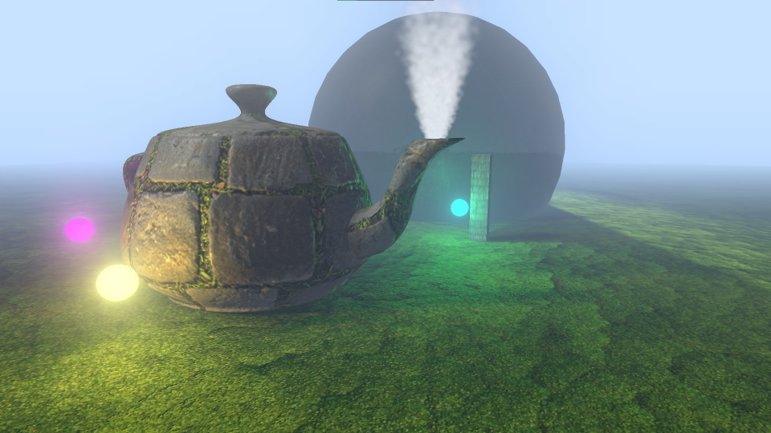
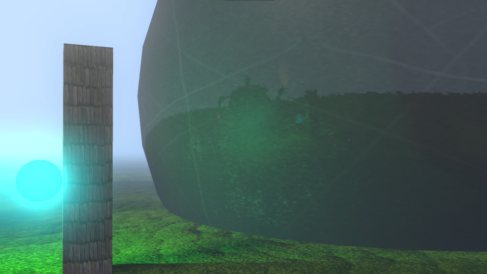

# DX12 Renderer

## Demos

- [LightingDemo.h](./DX12Renderer/LightingDemo/LightingDemo.h)
    - Models loaded from OBJ files;
    - Mipmapping
    - Phong lighting with a directional light and several point and spot lights;
        - Using diffuse, normal, gloss, and specular maps;
    - Particle system with CPU simulation (10000+ particles on screen) and instanced rendering;
    - Shadow mapping for the directional, point, and spot lights;
    - Soft shadows using 16x Poisson Sampling and Early Bail;
    - Dynamic environment reflections - see the sphere;
    - Post-processing:
        - Screen-space fog;
        - Bloom.

- [AnimationsDemo.h](./DX12Renderer/AnimationsDemo/AnimationsDemo.h)
    - Model and animations loaded from FBX files;
    - Skinning in the vertex shader;
    - Animation state blending;
    - Animation state merging (i.e., avatar masks).

### Controls

- Use <kbd>WASD</kbd>/Arrow Keys to move the camera;
- Hold <kbd>LMB</kbd> and move the mouse to orient the camera;
- Press <kbd>L</kbd> to toggle light animation.

### Requirements

- [assimp](https://github.com/assimp/assimp) accessible by the linker (e.g., installed via [vcpkg](https://vcpkg.io/en/index.html));
- [texconv](https://github.com/microsoft/DirectXTex/wiki/Texconv) accessible in PATH.

## Sources

- https://www.3dgep.com/learning-directx-12-1/
- https://www.3dgep.com/learning-directx-12-2/
- https://www.3dgep.com/learning-directx-12-3/
- https://www.3dgep.com/learning-directx-12-4/
- https://wiki.ogre3d.org/tiki-index.php?page=-Point+Light+Attenuation
- https://github.com/d3dcoder/d3d12book
- http://www.opengl-tutorial.org/ru/intermediate-tutorials/tutorial-16-shadow-mapping/
- https://learnopengl.com/Advanced-Lighting/Shadows/Point-Shadows
- https://catlikecoding.com/unity/tutorials/advanced-rendering/bloom/

### Libraries

- https://github.com/microsoft/DirectXTex
- https://github.com/microsoft/DirectXMesh
- https://github.com/assimp/assimp

### Assets

- https://casual-effects.com/data/
  - Teapot, Cube, Lat-Long Sphere
- https://ambientcg.com/view?id=PavingStones070
- https://ambientcg.com/view?id=Moss002
- https://ambientcg.com/view?id=Metal036
- https://www.mixamo.com/
